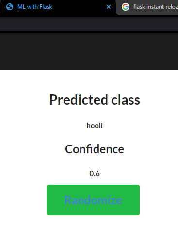

# Flask + ML template

[]()
[]()

Im tired of having to research flask templates all the time for small things, I'll make my own for Machine learning with sensible comments. then I can remember everything.

-----

## lets get to it

first, in the main folder to contain your app, you want to create a __templates__ folder. then in it create an _index.html_

```bash
mkdir templates
touch templates/index.html
```

So the templates folder will contain all your html 'views', index.html is one of  them and can be seen as a 'home page'. In it put the following code:

```html
<html>
    <head>
        <title>Predicted class: {{ class_name }}</title>
    </head>
    <body>
        <h1>Confidence: {{ probability }}</h1>
    </body>
</html>
```

__OR__, for a better look that includes _Semantic ui_ , put the following in your index.html


```html
<html>
    <head>
        <title>ML with Flask</title>
        <link rel="stylesheet" href="https://cdnjs.cloudflare.com/ajax/libs/semantic-ui/2.4.1/semantic.min.css">
        <script type="text/javascript" src="https://cdnjs.cloudflare.com/ajax/libs/jquery/3.3.1/jquery.min.js"></script>
        <script type="text/javascript" src="https://cdnjs.cloudflare.com/ajax/libs/semantic-ui/2.4.1/semantic.min.js"></script>
        <link rel="stylesheet" href="style.css">
    </head>
    <body text-align = "center">
        <div class="ui inverted container">
            <div class="ui inverted borderless menu topmenu">
                <h1 class="ui blue inverted header"><a class="ui item" href="/">APP NAME</a></h1>
            </div>
        </div>
        <div class="ui hidden divider"></div>
        <div class="ui hidden divider"></div>
        <div class="ui center aligned container">
            <h1 class="ui header">Predicted class: {{ class_name }}</h1>
            <h2 class="ui header" >Confidence: {{ probability }}</h2>
            <button class="massive ui green button">
                <a class="ui  item" href="/">Randomize</a>
            </button>
        </div>
    </body>
</html>

````

so in the code above, I intend to get two things from my pythone code, a class prediction and a probability, hence they the between ${{ . }}$, this is similar to how you show inline javascript in html: ${script}$, come to think of it.

----
## python code

So now that we know we want to show a predicted class and it confidence in our web browser, lets go ahead and get these to be random values as a base, without any trained machine learning model. ( this is a more reversed way to think of flask + ML, and is intended to appeal to ML researchers more). se will use Flask to render the html pages.

in the home directory of your app, just outside the templates directory, create an _app.py_.

```bash
touch app.py
```

In it, import the flask package and past in the following boiler plate code. __(Always import numpy (as np ofcourse) even if you don't need it yet to pay respect)__

```python
import numpy as np
import random
from flask import Flask
from flask import render_template

app = Flask(__name__)

#to render stuff to index.html
@app.route('/')
@app.route('/index')
def index():
    # assuming you are predicting 2 values from your ml model. (for now lets give random values)
    class_name_val = random.sample(['Things that look like DVDs', 'The ghost of Groot', 'Erlic','Bus','hooli'],1)[0]
    probability_val = int(random.sample([1,2,6,3,8,5],1)[0])/10

    return render_template('index.html', class_name=class_name_val, probability=probability_val)

app.run(debug=True)
```

Now you can start your app:

```bash
python app.py
```

### Result 

At this point if all is correct you should see this;
```bash
*...
*...
*Running on http://127.0.0.1:5000/ (Press CTRL+C to quit)
```

opening in the browser your should see this:



-----
++++++++++++++++++++++++++++++++++++++++++++++++++++++++++++++++++++++

## Reflaskful (react + flask)

So one step further Im gonna combine this flask app with a react front end. the goal is to eventually have a flask+meteor app. slowly we build into it


